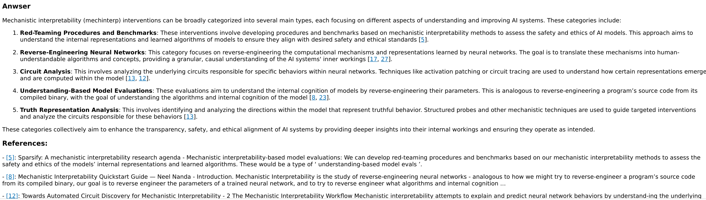

# stampy_nb

A debuggable RAG, with these features
- hybrid search
  - normal search
  - rephrased
  - example answer
  - [ ] TODO: add embedding
- [ ] TODO: add reranking
- citations, with tooltips and references
- debuggable

## Install requirements

This project uses [poetry](https://python-poetry.org/) for requirement and is set up for torch using cuda.
~~~
poetry install
~~~

